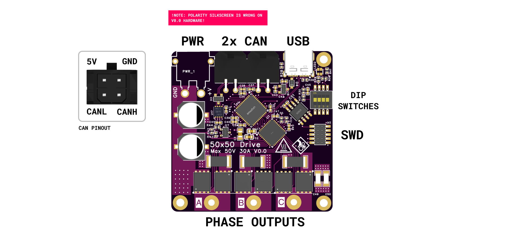
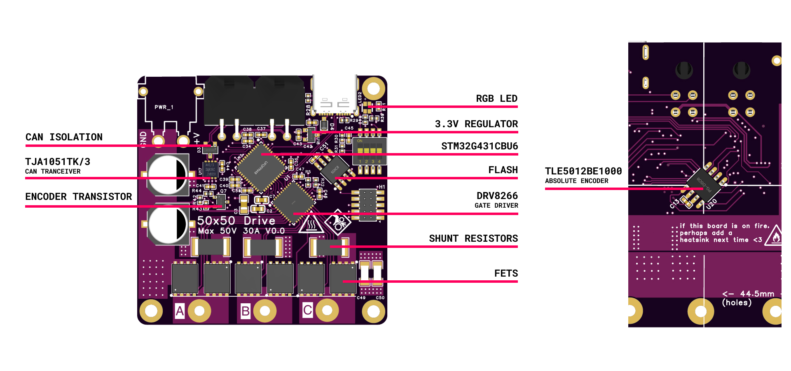

# Hardware

## Project link
Current hardware files are on EasyEDA and will likely stay until fixes for V0 are done. I am targeting switching to KiCad for V1.

[Project Link](https://oshwlab.com/pipdeream_thomas/bldc_driver_v0)

## Connectors and Pinout
The board has an XT30 power in plug, 2 daisy chainable CAN and 5V connectors, 1 USB-C plug, 1 Serial Wire Debug header. It also has a bank of 4 dip switches, one of which (4) is a CAN termination resistor and the rest are for whatever you want! (will likely default to be bits to set CAN-ID; having to set IDs in software kind of sucks)



## Components and Layout
The board is built around a [DRV8323HRTA](https://www.ti.com/product/DRV8323) gate driver chip from TI. The FET layout is very similar to the reference implementation (11.2 in the manual).

A [STM32G431Cx6](https://www.st.com/en/microcontrollers-microprocessors/stm32g431c6.html) is the MCU of choice, it's fast-enough, fairly available, cost effective and has just enough bells and whistles to be fun (CAN-FD, FPU, some math accelerators, USB crystal trimming).

:::{note}
There is currently no HSE, so all timing is done off the internal STM crystal, this might become an issue at some point but seems to be fine for now.
:::

The encoder is a [TLE5012BE1000](https://www.infineon.com/cms/en/product/sensor/magnetic-sensors/magnetic-position-sensors/angle-sensors/tle5012b-e1000/) an absolute magnetic encoder, which comes pre-flashed to provide quadrature outputs, with a pulse train given at startup to set the absolute offset. This is why there is a separate encoder 3.3V power rail hooked up to a transistor to power cycle it.

:::{admonition} Tangent
:class: note
I've had some back and forth over whether it's better to just interface with the encoder directly using it's comms protocol, I'm pretty sure the quadrature interface is faster, but you need to do the odd off/on routine to get it to index absolutely correctly. Future iterations will likely add the digital interface, then just drop back to quadrature for actual commutation.
:::





## Hardware Errors

```{toctree}
:maxdepth 1
known-faults
```