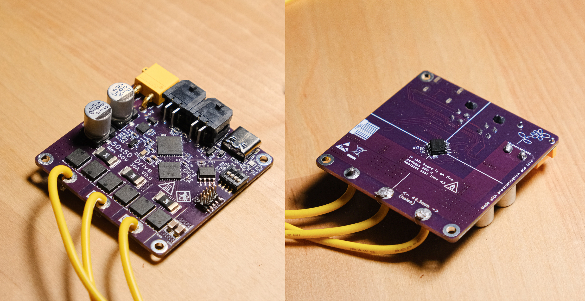

# 50x50 Drive



:::{admonition} Disclaimer
:class: warning
Read/Use at your own risk! I'm not fully sure what I'm doing.
:::

This is the documentation for the hardware, firmware and software for the 50x50 drive, a low-cost brushless motor controller.

The two main objectives for this project are
1. Come out of it with a good-enough-to-be-useful low-cost (sub $30) brushless motor controller 
1. Learn things (and have fun while doing that!)

Objective 2 means that a lot of things in this project are homebrew, part because it's a good learning experience and part because it's sometimes fun to go through the process of reinventing the wheel.

This, coupled with objective 1's "good enough" requirement mean that plenty of the implementation is minimal and quick, targeted at being easy to understand, debug and fix.

## Documentation Layout
```{toctree}
:maxdepth: 2
hardware/index
firmware/index
```

Documentation is unsurprisingly layed out into Hardware, Firmware and Software. If you are looking to get and run your own boards, but don't care about what's going on inside, you can safely skip most of the "Firmware" section (but I'd still recommend you read the top level page to get a quick idea of the hierarchy; it will likely save you some headaches)


## Other
### Acknowledgements
- Simple-FOC has a fantastic, well-documented FOC implementation
- Ben Katz's thesis
- ODrive